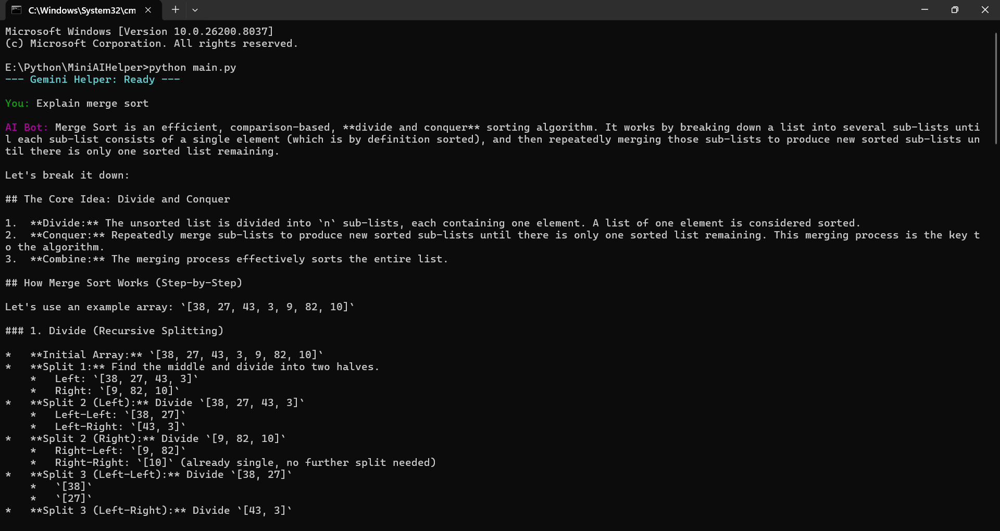

# MiniAIHelper

A lightweight terminal-based AI chat assistant built with the Gemini API.

MiniAIHelper provides a simple command-line interface for interacting with Google's Gemini models while handling rate-limit errors gracefully through automatic retries.

## Features

* Interactive terminal chat experience
* Powered by Gemini 2.5 Flash
* Environment variable-based API key management
* Automatic retry mechanism for rate-limit errors (429)
* Color-coded terminal interface
* Persistent conversation context within a chat session

## Tech Stack

* Python
* Gemini API
* python-dotenv
* termcolor

## Project Structure

```text
MiniAIHelper/
├── main.py
├── .env.example
├── .gitignore
└── README.md
```

## Installation

### Clone the repository

```bash
git clone https://github.com/<your-username>/MiniAIHelper.git
cd MiniAIHelper
```

### Install dependencies

```bash
pip install google-genai python-dotenv termcolor
```

## Configuration

Create a `.env` file in the project root:

```env
GEMINI_API_KEY=your_api_key_here
```

The `.env` file is ignored by Git for security reasons.

## Running the Application

```bash
python main.py
```

Example:



## Rate Limit Handling

If the Gemini API returns a rate-limit error (429), the application:

1. Waits before retrying.
2. Automatically retries the request.
3. Displays helpful messages if the quota is exhausted.

## Future Improvements

* Chat history export
* Markdown rendering
* Multiple model selection
* Streaming responses
* Conversation persistence

## License

This project is intended for learning and educational purposes.
